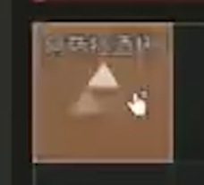
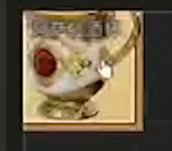
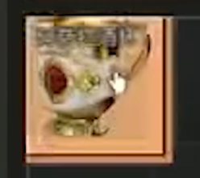
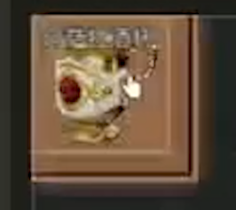
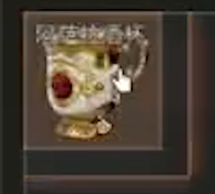
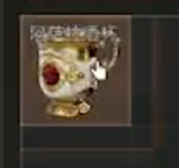

# 计划
- 大厅
```c++
    货币(制式券, 哈夫币), 仓库(摆放物品(横/竖))
```
- 摸金
```c++
    容器(保险)
```
## 容器格子
5x5/6x6


# 通用加载动画
- 品质背景(物品加载动画)
- 品质背景(高亮, 涟漪可见)|物品(放大, 半透明)|
- 品质背景(高亮, 涟漪放大)物品(放大, 不透明)
- 品质背景(高亮[半], 涟漪放大, 涟漪边缘光羽化)
- 品质背景(高亮[小半], 涟漪放大)
- 品质背景(涟漪放大)
- 品质背景(涟漪消失[半透明->透明])